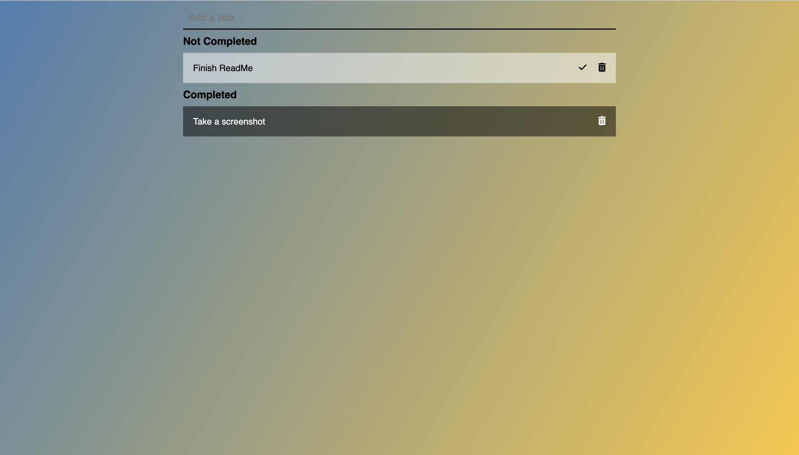

# todo-list
A page that allows a user to add items or tasks to a to do list.  Once the items are completed, they can click on the check mark to move it to the completed section.  There is also a delete button to remove them.

## Screenshots

Deployed Page: